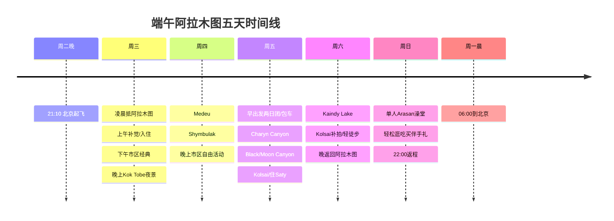

# 端午期间阿拉木图基地五天攻略报告

## 执行摘要

这次行程如果按你已经锁定的航班理解，实际在entity["city","Almaty","Almaty, Kazakhstan"]落地后的可用时间是 **周三到周日白天**，返程为 **周日 22:00 从阿拉木图起飞，周一 06:00 抵达北京**。结合 2026 年中国端午假期是 **6 月 19 日至 6 月 21 日（周五到周日）**，最可执行、又能把经典景点尽量打卡完整的方案，不是每天都从阿拉木图市区硬拉往返，而是采用 **“阿拉木图 3 晚 + 郊外 1 晚（Saty/Kolsai 一带）”** 的节奏：周三城市经典+你指定的“Kob 公园”夜景，周四 entity["point_of_interest","Medeu","Almaty, Kazakhstan"] + entity["point_of_interest","Shymbulak","Almaty, Kazakhstan"]，周五至周六用 2 天 1 夜完成 entity["point_of_interest","Charyn Canyon","Almaty Region, Kazakhstan"]、entity["point_of_interest","Kolsai Lakes","Almaty Region, Kazakhstan"]、entity["point_of_interest","Kaindy Lake","Almaty Region, Kazakhstan"]，周日留给你单人体验老派苏联风公共澡堂。这样强度仍然不低，但比“连续两天 16–17 小时极限一日团”舒服得多，也更接近你想要的“经典全打卡”。citeturn21search0turn15search1turn13search1turn14search1turn16search2

你特别提到的“**Kob 公园**”，本轮检索没有找到阿拉木图官方景点中与“Kob”完全对应的常用名称。结合游客语境、夜景需求和阿拉木图最常见的“晚上上山看城景”目的地，我在正文里按 **entity["point_of_interest","Kok Tobe","Almaty, Kazakhstan"]（科克托别山/公园）** 来处理；如果你原意是别的园区，出发前务必再核对一次。citeturn22search3turn22search11

最后一天想体验“**苏联澡堂**”完全可行，而且对单人旅行者也很友好。阿拉木图最稳妥、最有代表性的选择是 entity["local_business","Arasan Wellness & SPA","Almaty, Kazakhstan | Tulebayeva St 78, Almaty"]：官方确认其营业时间为 **每日 06:00–23:30**，位于市中心，可电话预约，公共浴区和附加搓澡/SPA 服务都在同一体系内。周末人会更密，若你想做搓澡或 venik（桦树枝拍蒸）类附加项目，建议至少提前 1–2 天预约。citeturn22search1turn22search2turn22search10turn21search17

整体预算方面，**不含国际机票**，按“阿拉木图中档酒店 3 晚 + 2 日 1 夜小团/拼团 + 市内吃喝和缆车澡堂”的现实玩法，比较合理的区间大致是 **人民币 2,600–5,200/人**；如果你把郊外改成高配私家团、城市住舒适型酒店并多吃高端餐厅，预算会上探。由于公开酒店价和团费页面所用币种不统一，正文预算表我会标注哪些属于“平台实时报价”、哪些属于“推算预算”。citeturn20search1turn20search2turn20search3turn20search7turn20search9turn21search7

## 行程逻辑与预订优先级

### 建议采用的行程骨架

这条时间线的依据是：端午 2026 年法定假期在 6 月 19–21 日，周五至周日正好适合把最远的峡谷湖泊放进去；而阿拉木图市区与 Medeu/Shymbulak 更适合安排在周中前段。把周日留在市区，也能给返程留出足够缓冲。citeturn21search0turn5search2turn15search1turn13search1

### 预订优先级

| 优先级 | 建议最晚完成时间 | 要订什么 | 原因 |
|---|---|---|---|
| 最高 | 出发前 10–14 天 | 周五–周六的 2 日 1 夜小团/私家团 | 这是全程最稀缺资源，也是决定你能否轻松打卡 Charyn/Kolsai/Kaindy 的关键；多家本地社都把这条线作为核心热门产品。citeturn15search1turn13search1turn14search1turn16search2 |
| 很高 | 出发前 7–10 天 | 阿拉木图酒店前 2 晚 + 周六夜返城 1 晚 | 端午撞周末，市中心口碑房和可退改房容易先涨价。公开平台价显示同城等级不同，夜价差距很大。citeturn20search1turn20search2turn20search3turn20search9 |
| 中高 | 出发前 3–5 天 | 周日澡堂附加服务（搓澡/按摩/venik） | entity["local_business","Arasan Wellness & SPA","Almaty, Kazakhstan | Tulebayeva St 78, Almaty"]周末人气高，游客反馈附加服务最好提前预约。citeturn22search2turn21search17 |
| 中 | 出发前 3–5 天 | 周四或周日的重点餐厅晚餐 | 像entity["restaurant","Sandyq","Almaty, Kazakhstan | Abylai Khan Ave 55, Almaty 050000"]这类高人气餐厅更适合提前占位。citeturn23search10turn23search6 |
| 低 | 出发前 1–2 天 | 机场接送、周四上山用车 | 凌晨抵达最好提前决定使用官方机场出租车还是 urlYandex Gohttps://go.yandex/en_kz/。一般不需要提早很久预订。citeturn6search7turn9search0turn9search3 |
| 很低 | 当天 | 市区门票、Shymbulak 缆车 | entity["point_of_interest","Shymbulak","Almaty, Kazakhstan"]官方票务可直接在线或现场购买。citeturn5search1turn5search2 |

## 每日详细行程

### 周三

我建议把这一天定义成“**落地恢复 + 市区轻量上手 + 晚上去 Kok Tobe**”。你凌晨落地，不建议当天去远郊；把最耗体力的峡谷湖泊放到后面，体验会明显更好。citeturn8search7turn6search7turn22search3

| 时间 | 行程 | 交通 | 预计耗时 | 门票 / 开放信息 | 备选 |
|---|---|---|---|---|---|
| 凌晨抵达后 | 机场到酒店，先睡一觉 | 官方机场出租车或 urlYandex Gohttps://go.yandex/en_kz/ | 约 30–45 分钟 | 官方机场已有出租车服务；公交白天有 92 路等，但你这个到达时段不建议用公交。citeturn6search7turn8search7turn9search3 | 若酒店支持，可加钱订提早入住 |
| 11:00–12:30 | 酒店附近 brunch / 缓慢出门 | 步行 | 1–1.5 小时 | 无固定门票 | 体力差就直接改成下午出门 |
| 13:00–14:30 | entity["point_of_interest","Panfilov Park","Almaty, Kazakhstan"] + entity["point_of_interest","Ascension Cathedral","Almaty, Kazakhstan"] | 打车或地铁+步行 | 1.5 小时 | 公园外部免费；教堂内部开放时段以现场为准，未确定 | 不进教堂也不影响完成度 |
| 14:40–15:40 | entity["point_of_interest","Green Bazaar","Almaty, Kazakhstan"] | 步行/短打车 | 1 小时 | 营业时段以当日公示为准，未确定 | 若太疲劳可，改到周日买伴手礼 |
| 16:00–17:30 | 回酒店休息 / 咖啡馆 | 打车 | 1–1.5 小时 | 无 | 保证晚间状态 |
| 18:30–21:30 | 你指定的“Kob公园”夜景，本文按 entity["point_of_interest","Kok Tobe","Almaty, Kazakhstan"]执行 | 打车上山或缆车 | 2.5–3 小时 | 夜间观景可行；但本轮未拿到稳定的官方英文价目和末班时刻，**票价/最晚入场未确定** | 下雨时改成周日傍晚再去 |
| 21:30 后 | 晚餐后回酒店 | 打车 | 20–30 分钟 | 无 | 若状态好可顺路看阿拉木图夜景街区 |

这一天的关键不是“刷满景点”，而是把时差和睡眠补回来，同时完成你明确要求的“第一天晚上去 Kob 公园”。entity["point_of_interest","Panfilov Park","Almaty, Kazakhstan"]、entity["point_of_interest","Ascension Cathedral","Almaty, Kazakhstan"]和entity["point_of_interest","Green Bazaar","Almaty, Kazakhstan"]都更适合以“顺走顺看”的方式完成。citeturn18search17turn22search3turn22search11

### 周四

这一天做“**Medeu + Shymbulak 山地日**”最合适。官方票务页面显示，entity["point_of_interest","Shymbulak","Almaty, Kazakhstan"]步行游客票常见价为 **单程 6,000₸、往返 10,000₸、360° 往返 12,000₸**；缆车运营时段公开写明 **Medeu–Shymbulak 09:00–18:00、Combi-1 09:00–17:00、Combi-2 09:00–16:30**。这意味着你最稳妥的上山窗口就是上午。citeturn5search1turn5search2turn5search4

| 时间 | 行程 | 交通 | 预计耗时 | 门票 / 开放信息 | 备选 |
|---|---|---|---|---|---|
| 08:30 | 从酒店出发去 entity["point_of_interest","Medeu","Almaty, Kazakhstan"] | 打车最省事 | 30–45 分钟 | Medeu 外场步行看台免费；若涉及特定场馆项目，当日售票为准，**未确定** | 也可参加半日/一日山地团 |
| 09:15–10:00 | Medeu 拍照、适应海拔 | 步行 | 45 分钟 | 无 | 体力差可缩短 |
| 10:00–13:30 | 乘缆车到 entity["point_of_interest","Shymbulak","Almaty, Kazakhstan"]，看山景、轻步行、喝咖啡 | 缆车 | 3–3.5 小时 | 官方票价：单程 6,000₸，往返 10,000₸，360° 往返 12,000₸；运营到 18:00/17:00/16:30。citeturn5search1turn5search2 | 如山上风大，改为只做到主站 |
| 13:45–15:00 | 午餐 | 山上餐厅或下山后吃 | 1–1.25 小时 | 餐费自理 | 推荐把正餐放到山下 |
| 15:30–17:00 | 下山回市区，自由活动 | 缆车+打车 | 1.5 小时 | 无 | 可补逛阿拉木图地铁/步行街 |
| 晚上 | 轻松晚餐、早点睡 | 步行/打车 | 自定 | 无 | 为周五长线保体力 |

如果这天碰上大风、降雨或缆车维护，最合理的替代方案是把周四改成 **中央国家博物馆 + 老城步行 + 好餐厅晚餐**；不要硬上山。Shymbulak 官方新闻页在 2026 年 4 月就发布过缆车维护与运营调整信息，说明山地设备的季节运维是真实存在的。citeturn5search0turn5search7turn5search12

### 周五

如果你的目标是“把哈萨克东南经典自然线一次打卡”，周五就该上 **Charyn–Kolsai–Kaindy 两天一夜线**。官方/半官方与本地团司公开资料都把这条线路描述为 **阿拉木图最经典的自然组合之一**；而且多家运营商把它固定做成 **2 天 1 夜、约 660–700 公里** 的成熟产品。citeturn15search1turn13search1turn14search1turn16search2

| 时间 | 行程 | 交通 | 预计耗时 | 门票 / 开放信息 | 备选 |
|---|---|---|---|---|---|
| 05:30–06:00 | 酒店接人，出发 | 小团/包车 4x4 或商务车 | — | 团费通常含车和导游；公园门票多为另付或已含，要看产品页 | 若你非常抗拒外宿，只能改一日暴走版 |
| 09:30 左右 | 抵达 entity["point_of_interest","Charyn Canyon","Almaty Region, Kazakhstan"]“城堡谷”一带 | 继续包车 | 北京时间体感约半天 | 国公园收费公开来源有差异：常见公开说法为 **730–1,500₸/人**，也有按车收取的写法；**官方统一英文价目未检到，现场为准**。citeturn10search0turn10search3turn10search15 | 若天气差，可只看主观景点不下谷底 |
| 09:30–12:00 | Charyn 主峡谷拍照、步行 | 步行 | 2–2.5 小时 | 开放通常按白天时段执行；部分公开资料写 08:00–19:00 或 daylight hours，**未确定**。citeturn10search0turn10search11 | 体力保守者不必走满 |
| 12:30–14:30 | Black / Moon Canyon 观景点 | 包车短转场 | 2 小时 | 无单独复杂门票公开信息 | 如团队不含可跳过 |
| 16:30–18:00 | 到 entity["point_of_interest","Kolsai Lakes","Almaty Region, Kazakhstan"]一号湖拍黄昏 | 包车 | 1.5 小时 | 常见公开说法约 **806₸/人 + 100₸/车**，但季节与门岗略有波动，现场为准。citeturn10search4turn10search6 | 若太晚，就留给周六早晨 |
| 夜间 | 住 Saty / Kolsai 区域民宿或客栈 | 团含住宿最省心 | 1 晚 | 多数 2 日团产品已含 | 若私家团可升级独卫房 |

这一晚外住虽然看起来“离开了阿拉木图基地”，但实际上它是把行程从“累但能玩”与“累到没体验”的分水岭拉开了。尤其是你想同时拍峡谷和两座湖，一晚外住几乎是性价比最高的做法。citeturn15search1turn13search1turn14search1turn16search2

### 周六

周六的核心是 **entity["point_of_interest","Kaindy Lake","Almaty Region, Kazakhstan"] + Kolsai 补拍/轻徒步 + 返回阿拉木图**。注意：Kaindy 最后接近湖区的道路本来就更 rough，本地运营商和攻略都把这段视为需要 UAZ/越野接驳或步行/骑马补完的典型路段；如果你是单人出行，我不建议你自驾硬闯。citeturn10search10turn10search20turn16search2

| 时间 | 行程 | 交通 | 预计耗时 | 门票 / 开放信息 | 备选 |
|---|---|---|---|---|---|
| 08:00–10:30 | 前往 entity["point_of_interest","Kaindy Lake","Almaty Region, Kazakhstan"] | 4x4 / UAZ / 步行接驳 | 2–2.5 小时 | Kaindy 与 Kolsai 常被视作分别收门票；现场会看护照，保留收据。citeturn10search4turn10search10 | 下雨天山路差，听司机临场判断 |
| 10:30–12:00 | 湖边拍照、短步道 | 步行 | 1–1.5 小时 | 无额外门票 | 不建议做高强度徒步 |
| 13:00–14:30 | 午餐 / 回到 Kolsai 附近 | 包车 | 1.5 小时 | 餐费视产品是否包含 | 若前一晚没拍够，可补拍一号湖 |
| 14:30–21:30 | 返回阿拉木图 | 包车 | 5.5–7 小时 | 无 | 最晚不要再安排高强度夜生活 |

几家团司对这条线都有共同提醒：**这是边境敏感区附近的国家公园路线，务必携带护照原件**；没有原件，边检/门岗有权不让进。这个提醒不是形式主义，而是被多家线路说明反复写明的。citeturn15search18turn10search10turn10search4

### 周日

周日是你整个旅程最该“慢下来”的一天：中午去澡堂，下午买伴手礼和吃一顿像样的收官餐，傍晚回酒店拿行李，19:00 左右去机场最稳妥。阿拉木图机场距市区大约 15–17 公里，白天车程通常 20–45 分钟，但周末和晚高峰仍可能拉长。citeturn8search7turn8search0turn8search14

| 时间 | 行程 | 交通 | 预计耗时 | 门票 / 开放信息 | 备选 |
|---|---|---|---|---|---|
| 09:30–10:30 | 慢早餐 / 办理退房（或寄存行李） | 步行 | 1 小时 | 无 | 若酒店可延迟退房更好 |
| 11:00–13:00 | 去 entity["local_business","Arasan Wellness & SPA","Almaty, Kazakhstan | Tulebayeva St 78, Almaty"] 体验公共澡堂 | 打车 | 2 小时 | 官方营业 **06:00–23:30**；公开价格页引导去官方 Instagram 查看实时价，第三方公开说法常见为 **白天约 2,500₸/小时、晚些时段约 3,200₸/小时**。citeturn22search1turn22search2turn21search1turn21search9 | 若只想体验，不做附加服务，1 小时足够 |
| 13:30–15:00 | 午餐 | 步行/短打车 | 1–1.5 小时 | 餐费自理 | 可选 Navat / Sandyq |
| 15:30–17:30 | 买伴手礼：Green Bazaar / TSUM / 步行街二选一 | 打车或步行 | 2 小时 | 无 | 体力差就直接回酒店休息 |
| 18:00–19:00 | 回酒店取行李，出发去机场 | 打车 | 1 小时 | 无 | 建议别赌公交 |
| 19:00–20:00 | 到机场，值机出境 | — | 2 小时缓冲 | 国际航班建议早点到 | 你的 22:00 航班完全来得及 |

**单人去公共澡堂是否尴尬？** 不会。像entity["local_business","Arasan Wellness & SPA","Almaty, Kazakhstan | Tulebayeva St 78, Almaty"]这样的城市大澡堂，本来就有很多自己来的本地人或商务旅客。更重要的是它分男女区域，单人体验没有社交门槛。真正要注意的反而是：周末附加服务位可能会紧张、不要拍照、带拖鞋、浴帽/毛巾可以自备也可现场买、超时会按分钟计费。citeturn22search10turn21search13turn21search17

## 住宿建议

如果你采用我上面的主方案，阿拉木图只需住 **3 晚市区酒店**，周五夜交给两日团去处理。这样最省体力。以下把住宿分成三档，并补一个“地标景观型”。价格均为 2026 年 5 月公开页面看到的**平台动态底价或起步价**，仅适合作预算。citeturn20search1turn20search2turn20search3turn20search9

你预订时优先用 **酒店官网 + urlBooking.comhttps://www.booking.com + urlTrip.comhttps://www.trip.com** 三方比价就够了；端午这种节点评价高、可退改、近地铁的房型通常最先没。citeturn18search0turn18search2turn18search10turn19search2

| 档位 | 酒店 | 地址 | 价格区间 | 适合谁 | 预订渠道 | 依据 |
|---|---|---|---|---|---|---|
| 舒适 | entity["hotel","Rahat Palace Hotel","Almaty, Kazakhstan | Satpaev St 29/6, Almaty 050040"] | Satpaev St 29/6 | 约 JPY 25,354+/晚（页面币种显示日元，未含税费） | 想住稳妥舒适型、带完整度假设施的人 | urlRahat Palace 官网https://rahatpalace.com/ / urlBooking.comhttps://www.booking.com / urlTrip.comhttps://www.trip.com | citeturn18search0turn20search2 |
| 舒适偏性价比 | entity["hotel","Kazzhol Park Hotel","Almaty, Kazakhstan | Nauryzbai Batyr St 108, Almaty 050004"] | Nauryzbai Batyr 108 | 约 US$145–169/晚 | 想住新一点、4 星、且离市中心步行范围内景点不远 | urlKazzhol Hotels 官网https://www.kazzholhotels.com/ / urlBooking.comhttps://www.booking.com / urlTrip.comhttps://www.trip.com | citeturn19search2turn20search3turn18search20 |
| 靠近景点 | entity["hotel","Almaty Hotel","Almaty, Kazakhstan | Kabanbay Batyr St 85, Almaty"] | Kabanbay Batyr 85 | 约 US$78+/晚 | 最适合第一天和最后一天，靠歌剧院、步行区、去 Panfilov / 绿巴扎都方便 | urlAlmaty Hotel 官网https://hotelalmaty.kz/en/ / urlBooking.comhttps://www.booking.com / urlTrip.comhttps://www.trip.com | citeturn18search2turn18search6turn20search1turn18search17 |
| 经济 | entity["hotel","LES Mini Hotel","Almaty, Kazakhstan | Nazarbayev Ave 193, Almaty 050013"] | Nazarbayev Ave 193 | 约 US$32–42/晚 | 单人、省预算、可接受“像商务青旅一样的简装房” | urlTrip.comhttps://www.trip.com / urlBooking.comhttps://www.booking.com | citeturn18search26turn17search22turn17search18 |
| 地标景观补充项 | entity["hotel","Hotel Kazakhstan","Almaty, Kazakhstan | Dostyk Ave 52/2, Almaty 050010"] | Dostyk Ave 52/2 | 约 US$59–87+/晚 | 喜欢苏联地标滤镜和城市天际线视角的人 | urlHotel Kazakhstan 官网https://kazakhstanhotel.kz/en/ / urlBooking.comhttps://www.booking.com / urlTrip.comhttps://www.trip.com | citeturn18search10turn18search25turn20search9 |

如果你只想让我给一句最省心的建议：**第一选择住 entity["hotel","Almaty Hotel","Almaty, Kazakhstan | Kabanbay Batyr St 85, Almaty"]，第二选择住 entity["hotel","Kazzhol Park Hotel","Almaty, Kazakhstan | Nauryzbai Batyr St 108, Almaty 050004"]。** 前者更方便“走着玩城市”，后者整体硬件更均衡。citeturn18search17turn18search13turn20search3

## 交通、接驳与一日游两日游选择

### 机场、市区与上山交通

你是**凌晨抵达**，所以机场到市区我不建议纠结公交。阿拉木图机场官方已上线机场出租车服务；同时官方航司信息明确提到机场与市区之间有 **92 路等公交**，但凌晨到达时段最稳妥的仍然是 **官方机场出租车或 urlYandex Gohttps://go.yandex/en_kz/**。预算上可先按 **5,000–7,000₸/车** 准备，具体会随时段波动；这一数值属于多来源估算，不是机场官方固定价。citeturn6search7turn8search7turn9search3turn9search10

去 entity["point_of_interest","Medeu","Almaty, Kazakhstan"] / entity["point_of_interest","Shymbulak","Almaty, Kazakhstan"] 的最佳做法是：**上山用打车，下山看体力再决定**。如果你想省心，直接打车到 Medeu，再买 entity["point_of_interest","Shymbulak","Almaty, Kazakhstan"]缆车票。Shymbulak 官方公布缆车时段和票价很清楚，但 Medeu 的非冬季项目票务并没有像缆车那样稳定公开，因此不要围着 Medeu 门票做计划。citeturn5search1turn5search2turn5search4

去 entity["point_of_interest","Charyn Canyon","Almaty Region, Kazakhstan"] 大致是 **单程 3.5–4 小时** 量级，去 entity["point_of_interest","Kolsai Lakes","Almaty Region, Kazakhstan"] / entity["point_of_interest","Kaindy Lake","Almaty Region, Kazakhstan"] 大致是 **单程 4.5–6 小时** 量级，Kaindy 最后一段路况更差。因此如果你不是熟悉山地路和当地驾驶规则的老司机，就不要因为“想以阿拉木图为基地”而强行自驾日往返。对单人旅客而言，**2 日 1 夜小团或 4x4 私家团** 的综合效率明显更好。citeturn10search0turn10search4turn10search18turn15search1turn13search1

### 旅行社样本比较

| 运营方 | 适合产品 | 公开价格样本 | 联系方式 / 预约 | 适合谁 | 依据 |
|---|---|---|---|---|---|
| urlBALTAShttps://baltastour.com/ | 1 日/2 日经典线 | Charyn 1 日 **US$30 起**；Kolsai+Charyn 1 日 **US$45 起**；Kaindy+Kolsai+Charyn 2 日 1 夜 **US$90 起** | WhatsApp **+7 747 234 73 58**；Rayimbek Ave 348 | 想找价格友好的英文可沟通地接 | citeturn14search0turn14search1turn14search2 |
| urlGreenXhttps://greenxtour.com/en/ | 私家/小团，品质稳 | Charyn+Kolsai 1 日约 **US$73–340/人**（随人数） ；Charyn+Kolsai 2 日约 **US$165–250/人**（随人数） | WhatsApp/Telegram **+7 771 737 7399**；email **info@greenxtour.com** | 想要行程节奏较好、重视服务口碑 | citeturn16search1turn13search1turn13search4turn16search2 |
| urlKazakhstan Guided Tourshttps://kazguidedtours.com/ | 2 日 1 夜 / 3 日线 | 2 日 1 夜线路公开写明 **660 km 往返**，价格页面本轮未抓到稳定展示，需询价；团订通常需 **15–50% 定金** | **+7 777 627 88 00**；email **info@kazguidedtours.com**；可 WhatsApp 确认 | 想要规则清晰、英文团、付款和取消条款明确 | citeturn15search0turn15search1turn15search4turn15search10 |
| urlKolsai Tourhttps://www.kolsaitour.com/ | 私家 SUV 强项 | 2 日私家线：SUV **US$550**（至多 4 人）；全包按人数约 **US$220–350/人**；1 日 Kaindy/Kolsai 线全包约 **US$125–275/人** | WhatsApp **+7 747 429 34 99**；email **kolsaitour@gmail.com** | 小团朋友出行、想直接做私家车 | citeturn12search1turn12search3turn12search13 |

如果你是**单人出行**，我会这样选：

- 想省钱：优先问 urlBALTAShttps://baltastour.com/ 有没有你那两天能拼上的 2 日 1 夜位子。citeturn14search0turn14search1
- 想稳：直接问 urlGreenXhttps://greenxtour.com/en/ 或 urlKazakhstan Guided Tourshttps://kazguidedtours.com/。citeturn16search1turn15search0
- 想舒适+更自由：只有在你能接受单价明显更高时，再考虑 urlKolsai Tourhttps://www.kolsaitour.com/的私家 SUV。citeturn12search1turn12search13

## 餐饮、穿衣与澡堂体验

### 吃什么最值得

阿拉木图做“第一次哈萨克味觉体验”并不难，最建议你优先尝试 **beshbarmak（手抓肉面片）**、**kazy（马肠）**、**manti（中亚大包子）**、**lagman（拉条子）**、**plov（抓饭）**、**baursak（油炸小面包）** 和 **shashlik（烤串）**。阿拉木图本身餐饮密度就非常高，官方城市美食页给出的口径是全城有数千家餐厅/咖啡馆，民族菜与现代餐饮并存。citeturn23search15

### 餐厅建议

| 餐厅 | 地址 | 人均预算 | 推荐场景 | 依据 |
|---|---|---|---|---|
| entity["restaurant","NAVAT","Almaty, Kazakhstan | Seifullin Avenue 500/79, Almaty 050012"] | Seifullin Ave 500/79 | 约 **5,000–7,000₸/人**，属于中档 | 第一天或最后一天吃一顿稳妥的中亚菜 | citeturn23search0turn23search8turn23search28 |
| entity["restaurant","Qazaq Auyl","Almaty, Kazakhstan | Gornaya St 586, Almaty 050000"] | Gornaya St 586 | 公开资料多写 **$$–$$$**；预算先按 **中高档** | 最适合周四做 Medeu/Shymbulak 日的山下正餐 | citeturn23search1 |
| entity["restaurant","Sandyq","Almaty, Kazakhstan | Abylai Khan Ave 55, Almaty 050000"] | Abylai Khan Ave 55 | 约 **20,000–25,000₸/人**，高配体验型 | 最后一晚或周日午后收官餐；建议预约 | citeturn23search6turn23search10turn23search22 |

如果你只打算认真吃一顿“哈萨克代表餐”，那就把预算留给 entity["restaurant","Sandyq","Almaty, Kazakhstan | Abylai Khan Ave 55, Almaty 050000"]；如果你更看重“稳、方便、不踩雷”，就用 entity["restaurant","NAVAT","Almaty, Kazakhstan | Seifullin Avenue 500/79, Almaty 050012"]解决第一天或最后一天。citeturn23search8turn23search10turn23search11

### 端午季节怎么穿

Weather Spark 的阿拉木图 6 月统计显示，**白天平均高温大约从 24°C 升到 29°C，夜间低温从 12°C 左右升到 16°C 左右**。也就是说，市区白天可以穿短袖，但早晚绝不算热；而去了 Medeu、Shymbulak、Kolsai 这种高海拔地点，体感通常还会再低 5–10°C，并且风明显更大。citeturn21search2turn21search6turn15search15

我建议你这样带：
- 市区：短袖/薄长袖、轻薄长裤、舒适运动鞋。
- 山地：**冲锋衣或防风外套**、薄抓绒、长裤、太阳镜、防晒、帽子。
- 峡谷湖泊线：再加一双耐走鞋，最好不是平底时装鞋。
- 澡堂：拖鞋、可替换内衣、小毛巾；想做 venik/搓澡可额外带不怕湿的简单洗护用品。citeturn16search2turn16search10turn22search10

### 单人澡堂体验建议

最后一天下午最推荐的仍然是 entity["local_business","Arasan Wellness & SPA","Almaty, Kazakhstan | Tulebayeva St 78, Almaty"]。它的优势在于 **位置市中心、时间长、老派苏联风格足、单人去也完全正常**。官方联系信息是电话 **+7 (727) 390 10 10 / +7 (702) 390 10 10**，邮件 **info@arasan-spa.kz**；价格页则由官网引导到官方 Instagram 看实时价。citeturn22search1turn22search2turn22search4

最实操的体验顺序是：**先泡——再蒸——再冷水/池——最后做搓澡或简单护理**。如果只是想“感受一次苏联公共澡堂文化”，你订 1 小时就够；如果你想认真做项目，至少预留 2 小时。游客反馈里反复提到：周末额外服务会更抢手，最好提前约，而且工作日白天更空。你这次是周日去，所以我更建议你把时间放在 **11:00–13:00** 或更早。citeturn21search5turn21search13turn21search17

## 入境、安全、预算与压缩备选

### 签证、入境与安全

根据哈萨克斯坦官方签证制度页面，中国普通护照持有人可享 **单次最长 30 天免签入境**；免签访问累计停留通常不得超过 **180 天内 90 天**。你的 5 天短途旅行在政策上完全没问题。citeturn6search5turn6search26turn6search30

真正需要你上心的不是签证，而是 **护照原件**。去 Kolsai / Kaindy 一线，多家团司和攻略都明示那是边境管理更严格的山区线路，门岗会查原件。别只带护照照片。citeturn15search18turn10search10turn10search4

安全层面，哈国官方公开紧急号码为：**警察 102、消防 101、急救 103、统一应急 112**。另外，阿拉木图机场与本地旅行方都提醒，不要随便在机场外接受不明司机搭讪，凌晨到达尤其如此。citeturn6search6turn6search3turn6search7turn9search18

### 人均预算分项表

以下预算**不含国际机票**，且属于“根据公开报价做的执行级预算”。汇率参考按 **1 CNY ≈ 68 KZT** 粗算；因为酒店和团费公开页面混用了 KZT / USD / JPY 等币种，人民币总额是为了帮助你快速决定“该花多少钱级别”，不是下单价保证。citeturn21search7turn21search3turn20search1turn20search2turn20search3turn20search9

| 项目 | 经济执行版 | 舒适执行版 | 说明 |
|---|---:|---:|---|
| 阿拉木图住宿 3 晚 | 约 RMB 700–1,300 | 约 RMB 1,700–3,600 | 取决于你住 entity["hotel","LES Mini Hotel","Almaty, Kazakhstan | Nazarbayev Ave 193, Almaty 050013"] / entity["hotel","Almaty Hotel","Almaty, Kazakhstan | Kabanbay Batyr St 85, Almaty"] / entity["hotel","Rahat Palace Hotel","Almaty, Kazakhstan | Satpaev St 29/6, Almaty 050040"]。citeturn18search26turn20search1turn20search2 |
| 周五–周六长线团 | 约 RMB 650–900 | 约 RMB 1,100–1,800 | 经济按urlBALTAShttps://baltastour.com/或低价拼团，舒适按urlGreenXhttps://greenxtour.com/en/或中高配私家/小团估算。citeturn14search1turn13search1turn16search2 |
| Medeu / Shymbulak 日 | 约 RMB 180–350 | 约 RMB 300–500 | 含缆车、打车和简餐。缆车官方票价透明，车餐取决于选择。citeturn5search1turn5search2 |
| 机场与市区机动交通 | 约 RMB 120–220 | 约 RMB 180–300 | 以打车为主的比较现实预算。citeturn6search7turn9search10 |
| 餐饮 | 约 RMB 400–700 | 约 RMB 800–1,400 | 是否去 Sandyq 拉开差距。citeturn23search8turn23search10turn23search6 |
| 周日澡堂 | 约 RMB 60–150 | 约 RMB 150–300 | 只买门票 vs 买附加项目。citeturn22search1turn21search1turn21search9 |
| **合计** | **约 RMB 2,600–3,200/人** | **约 RMB 3,800–5,200/人** | 以上均不含国际机票、签证以外自费项目与购物 |

### 时间紧凑时的压缩备选

如果你**坚持全程只住阿拉木图同一家酒店**，那就只能改成下面这个“压缩版”：

- 周三：市区 + Kok Tobe  
- 周四：Medeu + Shymbulak  
- 周五：Charyn 一日游  
- 周六：Kolsai + Kaindy 超长一日游  
- 周日：Arasan + 返程  

这个版本不是不能做，而是**很累**。因为公开线路里，Kolsai/Kaindy/Charyn 的单日“全都看”产品通常就是 16–17 小时级别。对第一次去哈萨克、又要保留周日返程状态的人来说，它明显不如两日一夜版本舒服。citeturn15search3turn12search12turn13search14

### 开放问题与限制

本报告已经尽量以官方旅游局、景区官网、本地运营商官网和高可验证平台为主，但仍有几处信息需要你在下单前二次确认：

- “**Kob 公园**”的准确景点中文/英文名称，本轮未找到与“Kob”完全一致的官方条目，正文按 **Kok Tobe** 处理。citeturn22search3turn22search11
- **Kok Tobe 缆车**晚间票价与末班时刻，本轮没有抓到稳定的官方英文价目，故标注为 **未确定**。  
- **Charyn / Kolsai / Kaindy 门票** 的公开说法存在“按人 / 按车 / 季节调整”的差异，最稳妥的做法是把它们当作**现场最终确认为准**。citeturn10search0turn10search4turn10search10
- 旅行社与酒店价格均为**动态报价**，临近端午和周末会变化，尤其是单人入住与单人参团的费率最容易浮动。citeturn20search1turn20search2turn20search3turn14search1turn16search2

可直接收藏的官方/半官方参考页有：urlVisit Almatyhttps://visitalmaty.kz/en/、urlShymbulak 票务页https://shymbulak.com/en/tickets/、urlArasan Wellness & SPAhttps://arasan-spa.kz/en/、urlKazakhstan Travelhttps://kazakhstan.travel/。
map